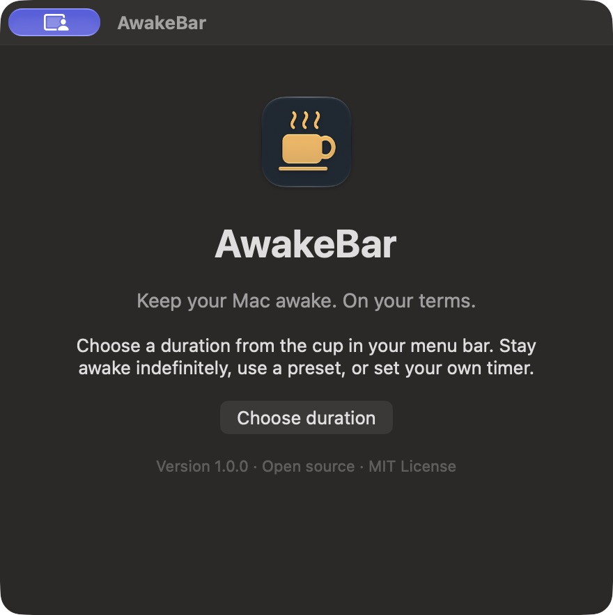
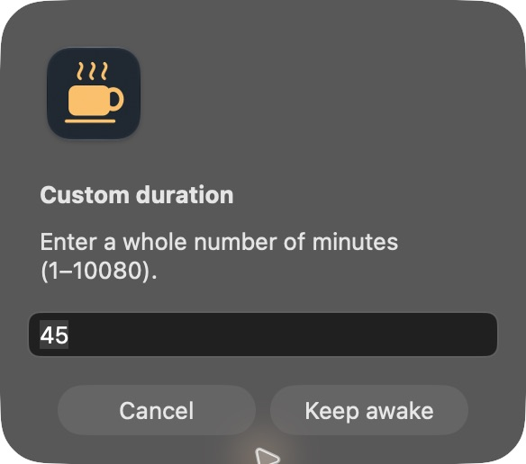

<p align="center"></p>
<h1 align="center">AwakeBar</h1>
<p align="center"><strong>Keep your Mac awake. On your terms.</strong></p>
<p align="center">A small, native menu bar app for those moments when your Mac needs to stay awake.</p>
<p align="center">
<a href="https://github.com/Charlisim/AwakeBar/releases/latest"></a>


<a href="LICENSE"></a>
</p>
<p align="center"><a href="https://awakebar.csimon.dev">Website</a> · <a href="https://github.com/Charlisim/AwakeBar/releases/latest">Download</a> · <a href="docs/USER_GUIDE.md">User guide</a> · <a href="CONTRIBUTING.md">Contribute</a></p>

## A little cup. A little more time.

Keep a presentation visible, follow a recipe, monitor a long task, or read without your screen going to sleep. AwakeBar lives in your menu bar and starts inactive.

- **Your schedule:** indefinitely, 20, 30, 60, or 120 minutes.
- **Your own timer:** any whole number from 1 to 10080 minutes.
- **Visible countdown:** remaining time beside the menu bar cup.
- **One-click stop:** choose **Allow sleep** to end the session.
- **Native and private:** AppKit + IOKit, no accounts, telemetry, or network requests.
- **No permanent changes:** assertions are released on stop, expiry, or exit.

## Screenshots

Actual captures of the macOS app, not mockups.

<p align="center"> </p>

## Download and install

1. Download **AwakeBar-1.0.0-macos-universal.zip** from [Releases](https://github.com/Charlisim/AwakeBar/releases/latest).
2. Unzip it and move **AwakeBar.app** into **Applications** or **~/Applications**.
3. Open the app. Click the cup in your menu bar to choose a duration.

Requires **macOS 14+**. The universal binary contains Apple Silicon (`arm64`) and Intel (`x86_64`) builds. Runtime validation is performed on Apple Silicon.

The downloadable build is **ad hoc signed and not notarized**. macOS may require explicit approval in **System Settings → Privacy & Security**. Review the source or build locally if you prefer. Developer ID signing and notarization are not configured for this release.

## What it keeps awake

AwakeBar holds a `PreventUserIdleDisplaySleep` assertion and periodically declares local user activity, using the same power-management approach as `caffeinate -d -u`. Keeping the display awake also prevents idle system sleep.

Manual locking, lid closure, forced sleep, and managed policies can still take effect. Screen saver and automatic-lock behavior depend on macOS settings and policies; AwakeBar does not promise to override them. It does not unlock a locked Mac.

## Build from source

Install Xcode or its Command Line Tools with **Swift 6+**, then:

```sh
git clone https://github.com/Charlisim/AwakeBar.git
cd AwakeBar
./script/build_and_run.sh
```

```sh
# Build the app bundle without launching
./script/build_and_run.sh --build-only
# Build a universal release ZIP and checksum
./script/package.sh
# Install in ~/Applications, backing up an existing installation
./script/install.sh
# Launch and check the process
./script/build_and_run.sh --verify
```

No third-party app dependencies. The build uses `--disable-sandbox` for the SwiftPM subprocess to support already sandboxed development tools. It does not disable macOS protections for the installed app.

## Project

[User guide](docs/USER_GUIDE.md) · [Development](docs/DEVELOPMENT.md) · [Changelog](CHANGELOG.md) · [Contributing](CONTRIBUTING.md) · [Security policy](SECURITY.md)

Built by [Carlos Simon](https://github.com/Charlisim). Released under the [MIT License](LICENSE).
